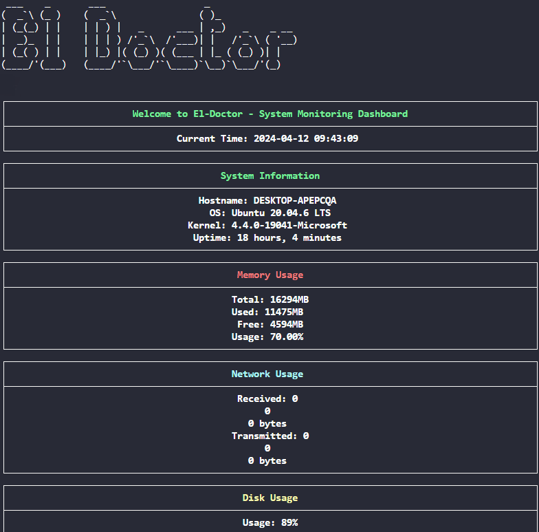
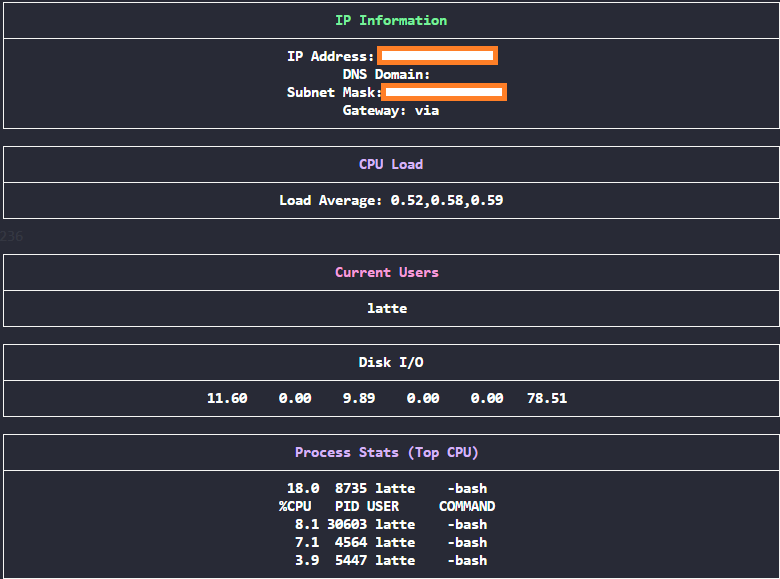

# El-Doctor: System Monitoring Dashboard

El-Doctor is a robust system monitoring solution designed to provide real-time insights into the performance and health of Linux systems. This repository houses two distinct implementations of El-Doctor: one written in Python and another in Bash. The focus of this repository is on the Bash implementation, which offers a text-based user interface leveraging the `bashsimplecurses` library to display system metrics in an easily digestible format.

## Features

- Real-time monitoring of system information including CPU load, memory usage, disk utilization, and network traffic.
  
- Detection of high CPU load conditions with alerting capabilities.
- Monitoring of login attempts and system file changes, with alerts for failed login attempts beyond a specified threshold.
  
- A visually organized dashboard created with `bashsimplecurses` to present system metrics clearly and concisely.

## System Analysis
El-Doctor analyzes system metrics using the following commands:

- **top**: Provides a dynamic real-time view of a running system, particularly CPU load.
- **free**: Displays the total amount of free and used physical and swap memory in the system.
- **df**: Reports the amount of disk space used and available on filesystems.
- **ifconfig**: Configures and displays network interface parameters.
- **iostat**: Generates reports of CPU and disk I/O statistics.
- **ps**: Reports a snapshot of the current processes.
- **awk**: A powerful pattern-scanning and processing language; used to parse command output.
- **bc**: An arbitrary precision calculator language; used for calculations in scripts, such as computing percentages.
- **inotifywait**: Waits for changes to files using Linux's inotify interface; used for monitoring file events.
- **mail**: Sends email messages from the command line; used to send alerts in the system monitoring scripts.
- **hostname**: Shows or sets the system's host name; used to retrieve the current hostname.
- **lsb_release**: Provides certain LSB (Linux Standard Base) and distribution-specific information; used to get the OS details.
- **uname**: Displays system information; used to get the kernel version.
- **uptime**: Tells how long the system has been running; used to get system uptime.
- **who**: Displays who is logged on; used to see active user sessions.
- **history**: Displays the command history; used to show the last executed commands for auditing.

These commands were chosen for their wide availability and reliability in providing essential system metrics on Linux systems.




## Installation

## BASH Script
Before using El-Doctor, ensure you have the following packages installed on your system:

- `bashsimplecurses`: For the text-based UI dashboard.
- `mailutils`: For sending email alerts.
- `inotify-tools`: For monitoring file changes.

You can install these packages on a Debian-based system using:

```sh
sudo apt-get update
sudo apt-get install inotify-tools mailutils
```

To install `bashsimplecurses`, clone the repository and source the `bashsimplecurses.sh` script in your `el_doctor.sh` script:

```sh
git clone https://github.com/metal3d/bashsimplecurses.git
cd bashsimplecurses
source bashsimplecurses.sh
```

### Usage
To start monitoring your system with El-Doctor, run the script:


```sh
./el_doctor.sh
```
## Python Script

The Python script provides similar functionalities as the Bash version but is implemented using Python's powerful libraries such as `psutil` for retrieving system information and `smtplib` for sending out email alerts.

To use the Python implementation of El-Doctor, ensure you have the following packages installed:

- `psutil`: For system monitoring.
- `sendmail`: For sending email alerts.
- `inotify`: For monitoring file changes.

 Can be easily extended with Python's extensive libraries for additional monitoring capabilities.


 ! Ensure you have configured the script with the appropriate email for alert notifications, and verify the monitoring thresholds according to your system's requirements.

## Alerts
El-Doctor provides alerts for the following conditions:

- **High CPU Load**: Alerts when the CPU load exceeds a specified threshold.
- **Failed Login Attempts**: Alerts when the number of failed login attempts exceeds a specified threshold.
- **File Changes**: Alerts when a file is created, modified, or deleted in a specified directory.

These alerts are designed to notify system administrators of potential issues or security breaches in real-time.


